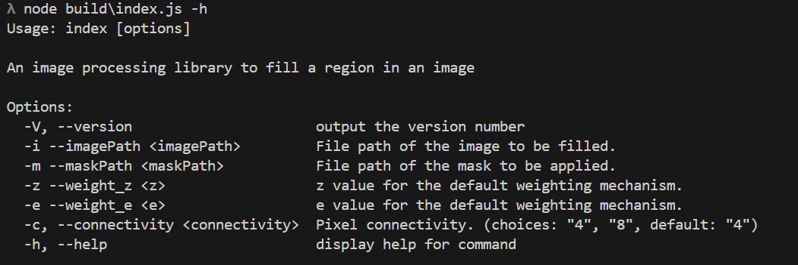

# Hole-Filling

An image processor built using NodeJs, TypeScript and [Sharp](https://github.com/lovell/sharp) that fills holes in images, along
with a simple command line utility built using [Commander](https://github.com/tj/commander.js).

**Hole Filling Algorithm**:

Definitions:

 - 𝐼: the input image.
 - 𝐼(𝑣): color of the pixel at coordinate 𝑣 ∈ ℤ .
 - 𝐵: set of all the boundary pixel coordinates. A boundary pixel is defined as a pixel that is
connected to a hole pixel, but is not in the hole itself. Pixels can be either 4- or
8-connected to the hole based on input. See this for more info.
 - 𝐻: set of all the hole (missing) pixel coordinates. You can assume the hole pixels are
8-connected with each other.
 - 𝑤(𝑣, 𝑢) : weighting function which assigns a non-negative float weight to a pair of two
pixel coordinates in the image.

Algorithm:

[%20%3D%20%5Cfrac%7B%5Csum_%7Bv%5Cin%20B%7D%20w(u%2Cv)%20.%20I(v)%7D%7B%5Csum_%7Bv%5Cin%20B%7D%20w(u%2Cv)%7D)](#_)

where

[%20%3D%20%5Cfrac%7B1%7D%7B%5ClVert%20u-v%20%5CrVert%20%5Ez%20%2B%20%5Cepsilon%7D)](#_)

## Running locally

### Installation

```sh
cd hole-filling-s
npm shell
```

### Requirements
 - [NodeJs - v22.11.0](https://nodejs.org/en)
 - [npm - v10.9.0](https://www.npmjs.com/)

### Usage



### Example

```sh
node build\index.js -i .\resources\Lenna.png -m .\resources\Mask.png -z 3 -e 0.01 -c 8
```


## Running in docker

```sh
cd hole-filling-ts
docker build -t tsholefilling .
docker run --rm -it -v HOST/PATH:/app/resources:rw tsholefilling
```

In the bash shell.. 

```bash
root@c4df36a09865:/app# ls
cli.js  holeFiller.js  index.js  node_modules  package-lock.json  package.json  pixel.js  resources  sharpUtils.js  weighting.js
root@992224d7c830:/app# node index.js -i ./resources/Lenna.png -m ./resources/Mask.png -z 3 -e 0.01 -c 8
```
